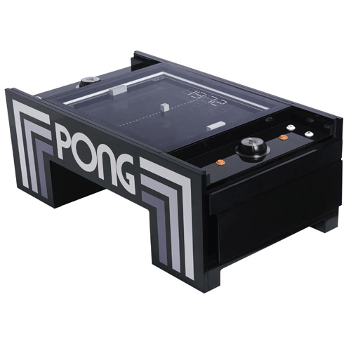

# CPPND: Capstone Tennis Game

This is my repo for the Capstone project in the [Udacity C++ Nanodegree Program](https://www.udacity.com/course/c-plus-plus-nanodegree--nd213).

I ve used the https://github.com/udacity/CppND-Capstone-Snake-Game as a base which was inspired by [this](https://codereview.stackexchange.com/questions/212296/snake-game-in-c-with-sdl) excellent StackOverflow post and set of responses.

The Capstone Project gave me a chance to integrate what i've learned throughout this program. 

This project remakes the classic atari game "pong".

## Feature-list:
* 2 Players which can move their tennis-racket
  * one player with arrow-up / arrow-down
  * one player with w-key / s-key
* ball
  * starts at center of the game
  * if ball hits side-wall, it bounces of
* counting points
  * if ball hits wall behind one player, the opposite player gains one point.
  * points are counted at the top-bar    
* There is a configuration class which can be used to configure the game
  * player names (shown at the top bar)
  * racket size
  * keys to control rackets

## Dependencies for Running Locally
* cmake >= 3.7
  * All OSes: [click here for installation instructions](https://cmake.org/install/)
* make >= 4.1 (Linux, Mac), 3.81 (Windows)
  * Linux: make is installed by default on most Linux distros
  * Mac: [install Xcode command line tools to get make](https://developer.apple.com/xcode/features/)
  * Windows: [Click here for installation instructions](http://gnuwin32.sourceforge.net/packages/make.htm)
* SDL2 >= 2.0
  * All installation instructions can be found [here](https://wiki.libsdl.org/Installation)
  >Note that for Linux, an `apt` or `apt-get` installation is preferred to building from source. 
* gcc/g++ >= 5.4
  * Linux: gcc / g++ is installed by default on most Linux distros
  * Mac: same deal as make - [install Xcode command line tools](https://developer.apple.com/xcode/features/)
  * Windows: recommend using [MinGW](http://www.mingw.org/)

## Basic Build Instructions

1. Clone this repo.
2. Make a build directory in the top level directory: `mkdir build && cd build`
3. Compile: `cmake .. && make`
4. Run it: `./TennisGame`.

## CC Attribution-ShareAlike 4.0 International

Shield: [![CC BY-SA 4.0][cc-by-sa-shield]][cc-by-sa]

This work is licensed under a
[Creative Commons Attribution-ShareAlike 4.0 International License][cc-by-sa].

[![CC BY-SA 4.0][cc-by-sa-image]][cc-by-sa]

[cc-by-sa]: http://creativecommons.org/licenses/by-sa/4.0/
[cc-by-sa-image]: https://licensebuttons.net/l/by-sa/4.0/88x31.png
[cc-by-sa-shield]: https://img.shields.io/badge/License-CC%20BY--SA%204.0-lightgrey.svg

## Overview of your code structure

## Necessary rubric

  ### Loops, Functions, I/O
  * The project demonstrates an understanding of C++ functions and control structures.
    * A variety of control structures are used in the project.
      * DONE overall
    * The project code is clearly organized into functions.
      * DONE overall
  * The project accepts user input and processes the input.
    * DONE: Using Keys for moving tennis racket -> Controller::HandleInput in controller.cpp
  
  ### Object Oriented Programming
  * The project uses Object Oriented Programming techniques.
    * -> The project code is organized into classes with class attributes to hold the data, and class methods to perform tasks.
      * DONE overall i.e. ball.h
  * Classes use appropriate access specifiers for class members.
    * All class data members are explicitly specified as public, protected, or private.
      * DONE overall i.e. ball.h
  * Class constructors utilize member initialization lists.
    * All class members that are set to argument values are initialized through member initialization lists.
      * DONE overall i.e. ball.h
  * Classes encapsulate behavior.
    * Appropriate data and functions are grouped into classes.
      * DONE overall
    * Member data that is subject to an invariant is hidden from the user. State is accessed via member functions.
      *   Class Racket in racket.cpp provides private float head_x and head_y via methods getHeadX() and getHeadY() which are used for example in ball.cpp Ball::hitsRacketLeft

  ### Memory Management
  * The project makes use of references in function declarations.
    * At least two variables are defined as references, or two functions use pass-by-reference in the project code.
      * Ball::Update in ball.cpp
      * Ball::handleLeftDirection in ball.cpp
      * Ball-constructor for Racket * racketLeft and Racket * racketRight in ball.h